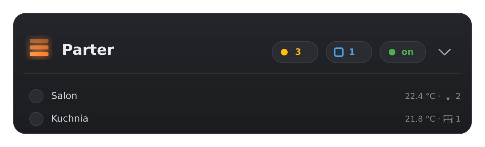

# Stratum




> Customowa karta Home Assistant — podsumowanie strefy z rozwijaną listą pomieszczeń.

**Stratum** (łac. _warstwa_) — metafora jest dokładna: dom ma warstwy (piętra,
strefy), każda warstwa ma swoje pomieszczenia. Karta pokazuje stan warstwy na
głownym poziomie (ile świateł włączonych, czy jest ruch, czy coś otwarte) i
pozwala rozwinąć listę pomieszczeń w środku.

Pomyślane dla domów z logicznym podziałem na piętra / strefy (Parter, Piętro,
Ogród), gdzie jeden rzut oka ma powiedzieć „co się dzieje u góry".

## Status

🚧 **v0.1 — szkielet.** Renderuje się, przyjmuje config, czeka na rozwój.
Roadmap v0.1 → v1.0 w [`docs/roadmap.md`](docs/roadmap.md).

## Instalacja przez HACS (custom repository)

**Wymagania**: [HACS](https://hacs.xyz/) zainstalowany w Home Assistant,
repozytorium musi być publiczne na GitHubie i mieć przynajmniej jeden release
z plikiem `stratum-card.js` jako asset.

### Krok po kroku

1. W Home Assistant otwórz **HACS** (menu po lewej)
2. Kliknij **trzy kropki** w prawym górnym rogu → **Custom repositories**
3. Wypełnij:
   - **Repository**: `https://github.com/<TWÓJ-USER>/stratum-card`
   - **Type**: `Dashboard`
4. Kliknij **Add**
5. Zamknij okno Custom repositories
6. W HACS wyszukaj **Stratum** → **Download**
7. Po instalacji HACS zasugeruje dodanie resource — zaakceptuj
   (albo ręcznie: *Settings → Dashboards → Resources*, typ `JavaScript Module`,
   URL `/hacsfiles/stratum-card/stratum-card.js`)
8. Odśwież dashboard: **Ctrl+Shift+R**

### Użycie

Dodaj kartę w dashboardzie (YAML lub przez UI → „Manual"):

```yaml
type: custom:stratum-card
area_id: parter          # ID area z twojego HA
```

Więcej przykładów w [`examples/dom-example.yaml`](examples/dom-example.yaml).

## Instalacja ręczna (bez HACS)

1. Pobierz `stratum-card.js` z [Releases](../../releases/latest)
2. Skopiuj do `/config/www/stratum-card.js`
3. *Settings → Dashboards → Resources → Add resource*
   - URL: `/local/stratum-card.js`
   - Type: `JavaScript Module`
4. Ctrl+Shift+R

## Szybki start — deweloper

```bash
git clone https://github.com/<user>/stratum-card.git
cd stratum-card
npm install
npm run build            # jednorazowy build
npm run watch            # rebuild on save (do developmentu)
```

Plik wyjściowy: `dist/stratum-card.js`. Skopiuj do `/config/www/` swojej instancji HA
żeby testować zmiany na żywo.

Szczegóły dev loopu, debug, podłączenie do lokalnej instancji — w
[`docs/development.md`](docs/development.md).

## Architektura w skrócie

- **Lit** jako framework komponentowy (standard HA custom cards)
- **TypeScript** dla type-safety z Home Assistant API
- **Rollup** jako bundler (single-file output, ES module)
- **CSS variables + ::part** jako API stylizacji (kompatybilne z `card-mod`)
- **Wszystko client-side** — karta czyta `hass.areas / hass.entities / hass.states`,
  nie wymaga żadnej integracji po stronie HA

Decyzje projektowe: [`docs/architecture.md`](docs/architecture.md).

## Praca z Claude Code

Projekt ma plik [`CLAUDE.md`](CLAUDE.md) z pełnym kontekstem — konwencje kodu,
roadmap, zasady edycji, jak się testuje. Claude Code wczyta to automatycznie
przy starcie sesji.

Typowy flow:

```bash
cd stratum-card
claude
```

Prompty iteracyjne (zgodnie z roadmapą):

- *„Zaimplementuj v0.2: czytanie encji w area przez hass.entities."*
- *„v0.3: rendering chipów — lights, motion, windows — z konfiguracji."*
- *„v0.4: animacja expandera z CSS transitions."*

## Licencja

MIT — patrz [`LICENSE`](LICENSE).
